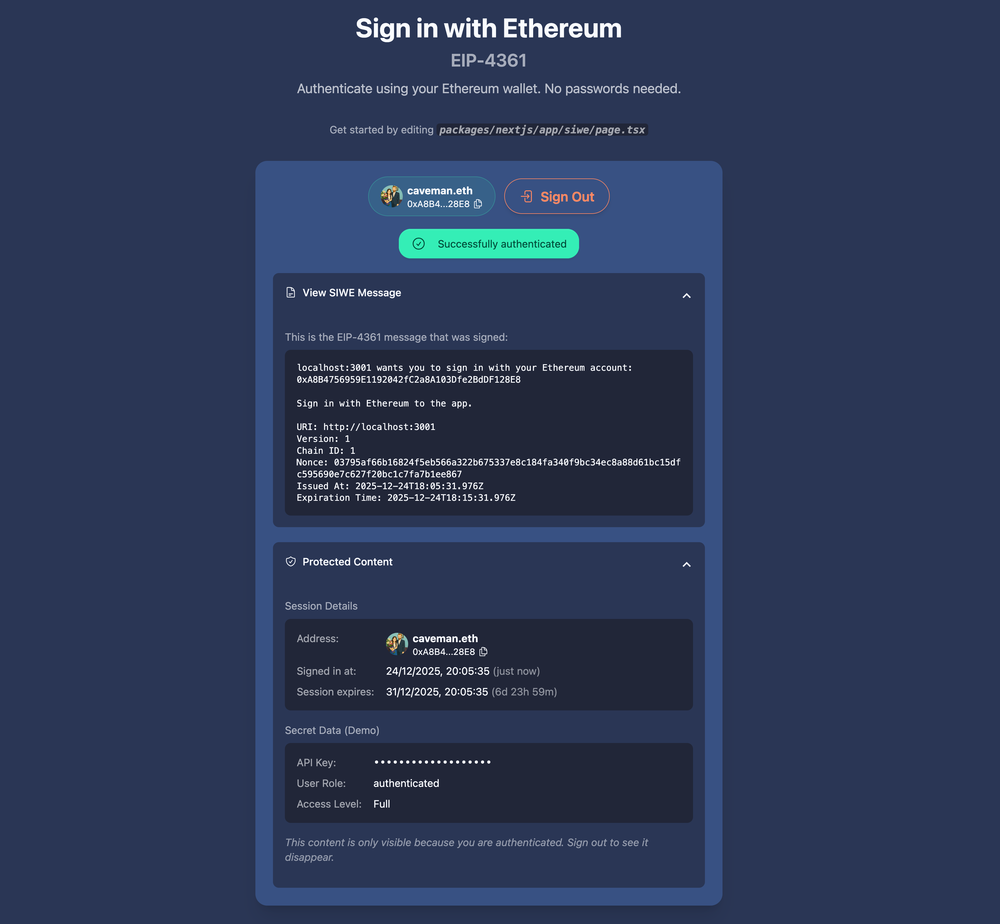

# SIWE Extension for Scaffold-ETH 2

Add **Sign-In with Ethereum (SIWE)** authentication to your Scaffold-ETH 2 project with a single command.



## Quick Start

```bash
npx create-eth@latest -e signinwithethereum/scaffold-siwe-ext
```

This will create a new Scaffold-ETH 2 project with SIWE authentication pre-configured.

## What's Included

### File Structure

```
packages/nextjs/
├── app/
│   ├── api/siwe/
│   │   ├── nonce/route.ts      # Generate cryptographic nonce
│   │   ├── verify/route.ts     # Verify signature & create session
│   │   └── session/route.ts    # Check session / logout
│   └── siwe/
│       └── page.tsx            # Demo page with examples
├── hooks/
│   └── useSiwe.ts              # React hook for SIWE auth
├── utils/
│   ├── siwe.ts                 # Session config & helpers
│   └── siwe.config.ts          # Customizable settings
└── components/
    └── Header.tsx.args.mjs     # Adds SIWE link to nav
```

### API Routes

| Endpoint | Method | Description |
|----------|--------|-------------|
| `/api/siwe/nonce` | GET | Generate a cryptographically secure nonce |
| `/api/siwe/verify` | POST | Verify SIWE message and create session |
| `/api/siwe/session` | GET | Check current session status |
| `/api/siwe/session` | DELETE | Sign out (destroy session) |

### Security Features

- ✅ **Domain validation** - Prevents cross-site attacks
- ✅ **Nonce validation** - Prevents replay attacks  
- ✅ **Message expiration** - Configurable time limit
- ✅ **ERC-6492 support** - Smart Contract Accounts work automatically
- ✅ **Multi-chain** - Ethereum, Polygon, Optimism, Arbitrum, Base, and more

## Usage Examples

### Basic Sign-In

```tsx
import { useSiwe } from "~~/hooks/useSiwe";

function MyComponent() {
  const { isSignedIn, address, signIn, signOut, isLoading, error } = useSiwe();

  if (!isSignedIn) {
    return (
      <button onClick={signIn} disabled={isLoading}>
        {isLoading ? "Signing in..." : "Sign in with Ethereum"}
      </button>
    );
  }

  return (
    <div>
      <p>Signed in as {address}</p>
      <button onClick={signOut}>Sign Out</button>
    </div>
  );
}
```

### Protected Content

```tsx
import { useSiwe } from "~~/hooks/useSiwe";

function ProtectedPage() {
  const { isSignedIn, isLoading } = useSiwe();

  if (isLoading) {
    return <div>Loading...</div>;
  }

  if (!isSignedIn) {
    return (
      <div>
        <h1>Access Denied</h1>
        <p>Please sign in to view this content.</p>
      </div>
    );
  }

  return (
    <div>
      <h1>Secret Dashboard</h1>
      <p>This content is only visible to authenticated users.</p>
    </div>
  );
}
```

### Displaying Session Info

```tsx
import { useSiwe } from "~~/hooks/useSiwe";

function SessionInfo() {
  const { isSignedIn, address, chainId, signedInAt } = useSiwe();

  if (!isSignedIn) return null;

  return (
    <div>
      <p>Address: {address}</p>
      <p>Chain ID: {chainId}</p>
      <p>Signed in: {new Date(signedInAt!).toLocaleString()}</p>
    </div>
  );
}
```

### Error Handling

```tsx
import { useSiwe } from "~~/hooks/useSiwe";

function SignInWithErrors() {
  const { isSignedIn, signIn, isLoading, error } = useSiwe();

  return (
    <div>
      {error && (
        <div className="alert alert-error">
          {error}
        </div>
      )}
      
      {!isSignedIn && (
        <button onClick={signIn} disabled={isLoading}>
          Sign in with Ethereum
        </button>
      )}
    </div>
  );
}
```

### Server-Side Session Check (API Route)

```ts
// app/api/protected/route.ts
import { cookies } from "next/headers";
import { getIronSession } from "iron-session";
import { SiweSessionData, sessionOptions } from "~~/utils/siwe";

export async function GET() {
  const session = await getIronSession<SiweSessionData>(
    await cookies(), 
    sessionOptions
  );

  if (!session.isLoggedIn) {
    return Response.json({ error: "Unauthorized" }, { status: 401 });
  }

  // User is authenticated - session.address is available
  return Response.json({ 
    message: `Hello ${session.address}!`,
    data: "secret stuff" 
  });
}
```

## Hook API Reference

| Property | Type | Description |
|----------|------|-------------|
| `isSignedIn` | `boolean` | Whether the user is authenticated |
| `address` | `Address \| null` | The authenticated Ethereum address |
| `chainId` | `number \| null` | The chain ID from authentication |
| `signedInAt` | `number \| null` | Unix timestamp when session was created |
| `isLoading` | `boolean` | Whether an operation is in progress |
| `error` | `string \| null` | Error message from last operation |
| `siweMessage` | `string \| null` | The SIWE message (for display) |
| `signIn` | `() => Promise` | Initiate sign-in flow |
| `signOut` | `() => Promise` | Sign out and destroy session |
| `checkSession` | `() => Promise` | Manually check session status |
| `isWalletConnected` | `boolean` | Whether a wallet is connected |
| `connectedAddress` | `Address \| undefined` | Currently connected wallet address |

## Configuration

Edit `utils/siwe.config.ts` to customize:

```typescript
const siweConfig = {
  // Session cookie duration (days)
  sessionDurationDays: 7,

  // How long user has to sign the message (minutes)
  messageExpirationMinutes: 10,

  // Statement shown in the SIWE message
  statement: "Sign in with Ethereum to the app.",
};
```

## Environment Variables

For **production**, you MUST set:

```env
IRON_SESSION_SECRET=your-secret-at-least-32-characters-long
```

Generate a secure secret:
```bash
openssl rand -base64 32
```

In development, a fallback secret is used automatically.

## How It Works

```
┌─────────────┐     1. Click "Sign In"      ┌─────────────┐
│   Browser   │ ──────────────────────────► │   Server    │
│             │ ◄────────────────────────── │             │
│             │     2. Return nonce         │             │
│             │                             │             │
│             │     3. Create SIWE message  │             │
│             │     4. Sign with wallet     │             │
│             │                             │             │
│             │     5. Send message + sig   │             │
│             │ ──────────────────────────► │             │
│             │                             │   Verify    │
│             │     6. Set session cookie   │   Signature │
│             │ ◄────────────────────────── │             │
│             │                             │             │
│  ✓ Signed   │     7. Authenticated!       │  ✓ Session  │
│    In       │                             │    Created  │
└─────────────┘                             └─────────────┘
```

## Tech Stack

- **[viem](https://viem.sh/docs/siwe/actions/verifySiweMessage)** - Native SIWE utilities *(already in SE-2)*
- **[wagmi](https://wagmi.sh)** - Wallet connection & message signing *(already in SE-2)*
- **[RainbowKit](https://rainbowkit.com)** - Wallet UI components *(already in SE-2)*
- **[iron-session](https://github.com/vvo/iron-session)** - Encrypted session cookies *(only new dependency)*

## What is SIWE?

Sign-In with Ethereum (SIWE, [EIP-4361](https://eips.ethereum.org/EIPS/eip-4361)) is an authentication standard that allows users to sign in to web applications using their Ethereum wallet. Instead of usernames and passwords, users prove ownership of their Ethereum address by signing a message.

Learn more at [siwe.xyz](https://siwe.xyz).

## Credits

Built for [Scaffold-ETH 2](https://github.com/scaffold-eth/scaffold-eth-2).

## License

MIT
